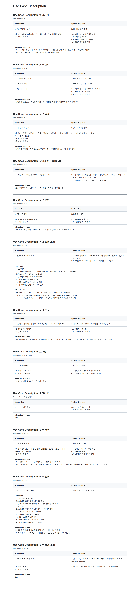

# UML
2026-1 Software Engineering UML Project

## TOOLS

## UI
<strong>[Figma](https://www.figma.com/design/HAsKKZz4UbKE3UXQzPWVpJ/UML-UI-Design?m=auto&t=LxxIMEJjQ57s9paO-1)</strong>
| Section | Contributor |
| :--: | :--: |
| S1 | H0sungKim |
| S2 | plames90 |
| S3 | 1window2 |
| S4 | ktg3891 |

## Use Case Diagram
<strong>Rendered by [PlantUML Web Server](https://www.plantuml.com/plantuml/uml/)</strong>   

## Use Case Description

## Credits
<table id='credit'>
<tr>

<td align="center">

 

</td>

<td align="center">

 

</td>

<td align="center">

 

</td>

<td align="center">

 

</td>
